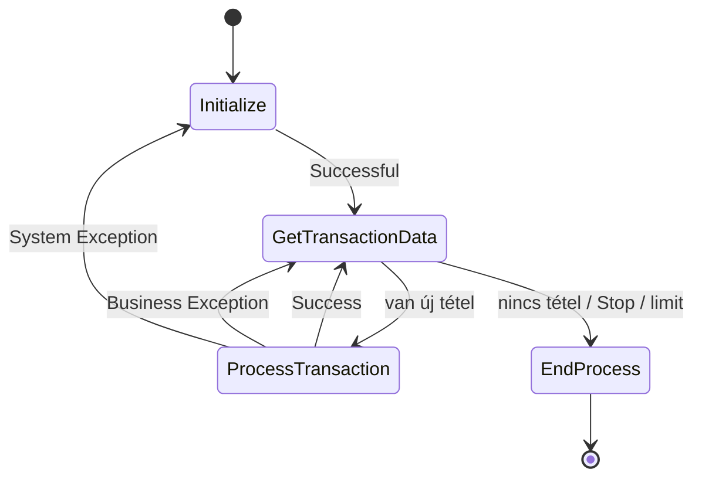
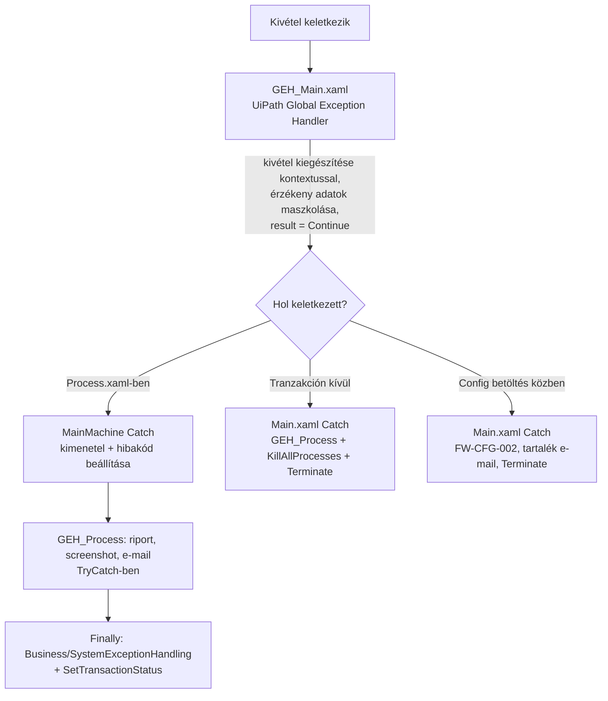

# 1. Architektúra – hogyan működik a keretrendszer

[← Tartalom](README.md)

## 1.1 Mi a ReFrameWork?

A ReFrameWork (Robotic Enterprise Framework) egy **tranzakció-alapú** folyamatsablon. A robot egy Orchestrator **queue**-ból egyenként veszi ki a feladatokat (**queue item**, más néven tranzakció), és mindegyiket ugyanazzal a logikával dolgozza fel.

A keretrendszer elvégzi a „körítést”:

- beolvassa a konfigurációt,
- megnyitja és bezárja az alkalmazásokat,
- lekéri a következő tételt,
- kezeli a hibákat (újrapróbálás, értesítés, riport),
- beállítja a tétel státuszát az Orchestratorban.

**Neked csak azt kell megírnod, mi történjen egy tétellel.** Ez a `Process.xaml`.

## 1.2 Mappaszerkezet

| Mappa / fájl | Tartalom | Módosíthatod? |
|---|---|---|
| `Main.xaml` | Belépési pont: munkaidő-ellenőrzés, Config betöltés, állapotgép indítása | ⚠️ Csak indokolt esetben |
| `MainMachine.xaml` | Az állapotgép (lásd 1.3) | ⚠️ Csak indokolt esetben |
| `Process.xaml` | **Egy tranzakció üzleti logikája** | ✅ Ide írsz |
| `0_Framework/` | Keretrendszer-workflow-k (Init, Close, Kill, SetTransactionStatus, SendEmail …) | Részben: `InitAllAplications`, `CloseAllApplications`, `BussinesExceptionHandling`, `SystemExceptionHandling` ✅ |
| `1_GEH/` | Globális kivételkezelő (GEH) és a hibakód-katalógus | ⚠️ Csak keretrendszer-szintű változtatás |
| `1_GEH/ErrorHandling/` | `ErrorCatalog`, `Err`, `ErrorPolicy`, `LoadErrorCatalog` | ⚠️ Csak keretrendszer-szintű változtatás |
| `2_Application_Layer/` | Alkalmazásonkénti műveletek (Login, Keresés, Mentés …) | ✅ |
| `3_Business_Logic/` | Üzleti szabályok, számítások, validációk | ✅ |
| `4_Reusable_Modules/` | Projektfüggetlen segédmodulok | ✅ |
| `5_Test/` | Tesztesetek | ✅ |
| `Configuration/Config.xlsx` | Beállítások, assetek, hibakódok | ✅ |
| `Templates/` | E-mail és riport sablonok | ✅ |

## 1.3 Az állapotgép (MainMachine.xaml)



| Állapot | Mit csinál? |
|---|---|
| **Initialize** | Első futáskor: kivétel-mappa létrehozása és takarítása (egy hónapnál régebbi fájlok törlése), `KillAllProcesses`, `InitAllAplications`. Rendszerhiba utáni visszatéréskor: ellenőrzi, elérte-e a robot a `MaxConsecutiveSystemExceptions` határt. Ha igen, `FW-SYS-001` hibával leáll. Ha nem, újraindítja az alkalmazásokat. |
| **Get Transaction Data** | Megnézi, küldött-e az Orchestrator Stop jelet, elérte-e a robot az `in_Limit` határt, majd lekéri a következő queue itemet. |
| **Process Transaction** | Meghívja a `Process.xaml`-t. Hiba esetén meghatározza a kimenetelt (Business / System) és a hibakódot, lefuttatja a `GEH_Process`-t (riport, screenshot, e-mail), végül a `SetTransactionStatus`-t. |
| **End Process** | `CloseAllApplications`, majd vége. |

### A tranzakció három lehetséges kimenetele

| Kimenetel | Mikor? | Queue státusz | Mi történik utána? |
|---|---|---|---|
| **Success** | A `Process.xaml` hiba nélkül lefutott | Successful | Következő tétel |
| **Business Exception** | `BusinessRuleException` keletkezett (pl. `Err.Business(...)`) | Failed – Business | Következő tétel, **nincs újrapróbálás** |
| **System Exception** | Bármilyen más kivétel | Failed – Application | Az Orchestrator újrapróbálja (Max # Retries), a robot újrainicializálja az alkalmazásokat |

## 1.4 A Main.xaml lépései

1. **Munkaidő-ellenőrzés** (`CheckWorkingHours`): ha az `in_NonWorkingHours` meg van adva, és az aktuális idő egy tiltott intervallumba esik, a robot leáll.
2. **Limit beállítása:** `GlobalVariables.MaxQueueItem` értéke:
   - `in_StopAtLimit = False` esetén `-1` (korlátlan);
   - egyébként `in_Limit`, legalább 1.
3. **Config betöltése** (`InitAllSettings`): a Settings és az Assets lap, valamint az `ErrorCodes` lap betöltése. Ha ez hibázik, a robot `FW-CFG-002` kóddal leáll, és ha meg van adva, e-mailt küld az `in_FallbackAlertEmail` címre.
4. **Queue item létrehozása**, ha `TransactionalProcess = False` (`CreateQueueItem`).
5. **Állapotgép futtatása.** Ha az állapotgépen belül, de a tranzakción kívül keletkezik hiba (**Main exception**), akkor lefut a `GEH_Process`, a `KillAllProcesses`, majd a Terminate.

## 1.5 A globális változók

Az `InitAllSettings` után bárhonnan elérhetők:

| Változó | Típus | Tartalom |
|---|---|---|
| `GlobalVariables.Config` | `Dictionary<string, object>` | Settings lap + nem-credential assetek |
| `GlobalVariables.Credentials` | `Dictionary<string, PSCredential>` | Credential assetek |
| `GlobalVariables.MaxQueueItem` | `int` | Feldolgozandó tételek max. száma (`-1` = korlátlan) |

```csharp
// Olvasás – mindig string-gé / típusra alakítva
var folder = GlobalVariables.Config["OrchestratorQueueFolder"].ToString();
var sapCred = GlobalVariables.Credentials["SAP_Login"];   // PSCredential
```

## 1.6 A hibakezelés rétegei



A részleteket a [4. fejezet](04_Hibakezeles.md) tárgyalja.

## Összefoglaló

- A robot egyenként dolgozza fel a queue itemeket; te a `Process.xaml`-t írod.
- Egy tétel kimenetele Success, Business vagy System lehet. **A Business hibát nem próbálja újra**, a System hibát igen.
- A Config és a hitelesítő adatok a `GlobalVariables`-ben érhetők el.
