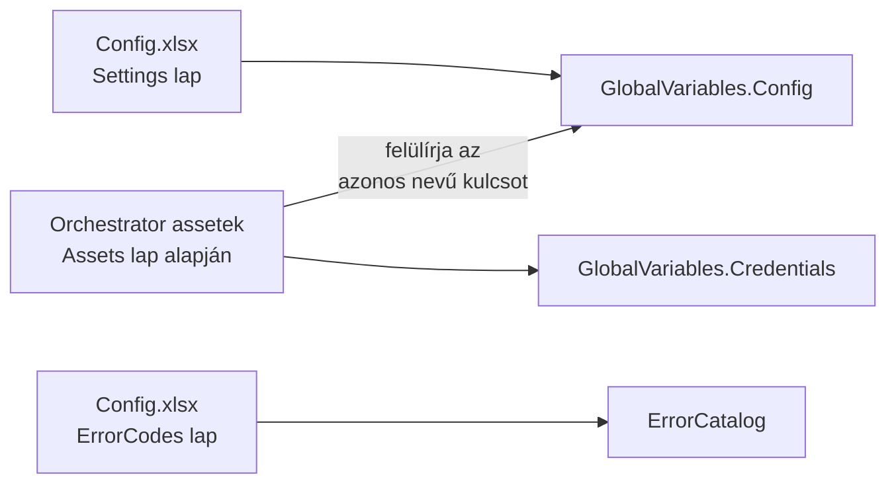

# 3. Konfiguráció – Config.xlsx és argumentumok

[← Tartalom](README.md)

## 3.1 A konfiguráció forrásai és sorrendje



1. A **Settings** lap soraiból a `Name` → `Value` párok bekerülnek a `GlobalVariables.Config`-ba.
2. Az **Assets** lap alapján az `InitAllSettings` lekéri az Orchestrator asseteket. Az asset **felülírja** az azonos nevű Settings értéket.
3. Az **ErrorCodes** lap a hibakód-katalógusba kerül (lásd [4. fejezet](04_Hibakezeles.md)).

## 3.2 Settings lap – kulcsok

| Kulcs | Típus | Ki használja? | Leírás |
|---|---|---|---|
| `AutomationName` | string | GEH_Process, Process | A folyamat neve (e-mail tárgy, törzs) |
| `RobotName` | string | GEH_Process | Az e-mailek aláírása |
| `Debug` | bool | MainMachine (log) | Jelenleg **csak logol**, az e-mail küldést nem tiltja le (`todo.md` M pont) |
| `TransactionalProcess` | bool | Main | `True`: a tételek már a queue-ban vannak. `False`: a robot maga hoz létre egy tételt (`CreateQueueItem`) |
| `OrchestratorQueueFolder` | string | MainMachine, SetTransactionStatus | Az Orchestrator mappa. Üresen a job saját mappája |
| `OrchestratorQueueName` | string | MainMachine (GetQueueItem) | A queue neve |
| `QueueMaxRetryNumber` | int | MainMachine, GEH_Process | **Egyezzen a queue Max # Retries értékével.** Ebből dől el, hogy egy rendszerhibás tétel az utolsó kísérletnél tart-e |
| `ProcessesToKill` | string | KillAllProcesses | Vesszővel elválasztott folyamatnevek |
| `ClearExceptionFiles` | bool | – | Jelenleg **nincs használatban**: a takarítás mindig fut, és az egy hónapnál régebbi fájlokat törli (`todo.md` N pont) |
| `ExceptionSubFolder` | string | InitAllSettings | A kivétel-fájlok almappája. `ExceptionFolder = ExceptionMainFolder + ExceptionSubFolder` |
| `MaxConsecutiveSystemExceptions` | int | MainMachine | Ennyi **egymást követő** rendszerhiba után a robot leáll (`FW-SYS-001`). Üresen hagyva a funkció ki van kapcsolva |
| `ShouldTakeScreenshot` | bool | GEH_Process | Készüljön-e képernyőkép hiba esetén |
| `ShouldSendBusExEmails` | bool | GEH_Process | E-mail minden üzleti hibáról |
| `ShouldSendSysExEmails` | bool | GEH_Process | E-mail rendszerhibáról, **csak az utolsó kísérletnél** |
| `ShouldSendMainExEmails` | bool | GEH_Process | E-mail Main hibáról |
| `BusinessExceptionEmailAddresses` | string | GEH_Process | Üzleti hiba címzettjei |
| `SystemExceptionEmailAddresses` | string | GEH_Process | Rendszerhiba címzettjei (Main hibánál is kapnak) |
| `MainExceptionEmailAddresses` | string | GEH_Process | Main hiba címzettjei. Alapértelmezetten Global asset |
| `MailSubject` | string | GEH_Process, Process | Tárgy-sablon: `{result}`, `{automationName}`, `{reference}`, `{timeStamp}` |

## 3.3 Assets lap

| Oszlop | Leírás |
|---|---|
| `Asset` | Az asset neve az Orchestratorban |
| `IsCredential` | `TRUE` = credential asset (→ `GlobalVariables.Credentials`), `FALSE`/üres = sima asset (→ `GlobalVariables.Config`) |
| `Name` | A kulcs, amelyen a kódban eléred. Üresen az `Asset` a kulcs |
| `OrchestratorAssetFolder` | Az asset mappája (pl. `Global_Assets`) |

Az alapértelmezett Global assetek:
- `MainExceptionEmailAddresses`
- `ExceptionMainFolder`
- `ConnectionString`

## 3.4 ErrorCodes lap

| Oszlop | Kötelező | Leírás |
|---|---|---|
| `Code` | ✅ egyedi | Pl. `PRJ-BE-001` |
| `Message` | ✅ | `string.Format` sablon: `A(z) {0} számla nem található` |
| `Remedy` | ajánlott | Javítási javaslat. A queue item Details mezőjébe és az e-mailbe kerül |

Ha a lap hibás (hiányzó oszlop, duplikált kód, üres Message), a robot induláskor `FW-CFG-001` hibával leáll. Ez szándékos: jobb azonnal észrevenni, mint élesben félrevezető hibaüzeneteket kapni.

## 3.5 Main.xaml argumentumok (Orchestrator job paraméterek)

| Argumentum | Alapértelmezett | Leírás |
|---|---|---|
| `in_ConfigFilePath` | `Configuration\Config.xlsx` | A Config fájl útvonala |
| `in_Limit` | `1` | Legfeljebb ennyi tételt dolgoz fel egy job (0 vagy negatív → 1) |
| `in_StopAtLimit` | `True` | `False` esetén nincs limit: addig fut, amíg van tétel |
| `in_NonWorkingHours` | üres | Tiltott időszakok: `14:00-15:00,17:00-17:30`. Éjfélen átnyúló intervallum jelenleg **nem támogatott** (`todo.md` 5. pont) |
| `in_FallbackAlertEmail` | üres | Tartalék címzett(ek) arra az esetre, ha a Config betöltése hibázik. **Élesben mindig töltsd ki!** |

## 3.6 Best practice-ek

- ✅ **Minden környezetfüggő érték a Configba vagy assetbe kerüljön:** mappa, queue, URL, e-mail cím, fájlútvonal.
- ✅ **Érzékeny adat csak credential assetben lehet**, soha nem a Config.xlsx-ben. A Config.xlsx a repóban van!
- ✅ **Környezetenként eltérő érték** (DEV/TEST/PROD) → asset. Az asset felülírja a Settings értéket, így a Config.xlsx ugyanaz maradhat minden környezetben.
- ✅ Új kulcsnál töltsd ki a **Description** oszlopot is. A következő fejlesztő ebből fogja megérteni.
- ✅ Olvasáskor kezeld a hiányzó vagy üres értéket:

```csharp
// Rossz – NullReferenceException / FormatException, ha a kulcs hiányzik vagy üres:
var max = Convert.ToInt32(GlobalVariables.Config["MaxItems"]);

// Jó – GetValueOrDefault + TryParse:
var max = int.TryParse(Convert.ToString(GlobalVariables.Config.GetValueOrDefault("MaxItems")), out var m) ? m : 10;
```

- ❌ Ne nevezz át és ne törölj piros (kötelező) kulcsot. A keretrendszer név szerint hivatkozik rájuk.
- ❌ Ne tárold a Config.xlsx-et nyitva futtatás közben. A betöltés zárolt fájlnál hibázik (`FW-CFG-002`).
