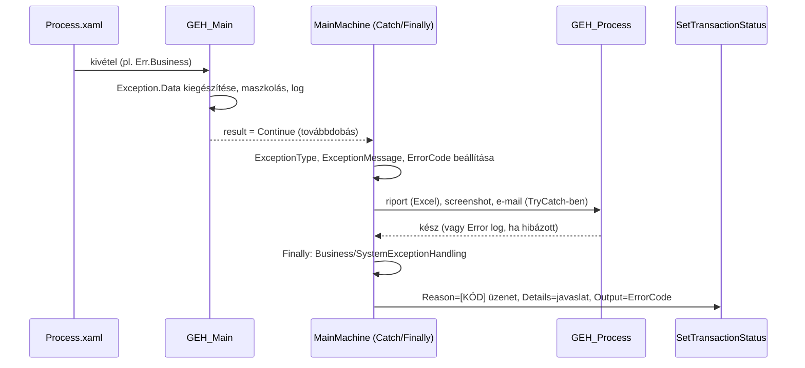

# 4. Hibakezelés és hibakódok

[← Tartalom](README.md)

Ez a kézikönyv legfontosabb fejezete. Egy robot értékét nem az adja, hogy a jó eseteket feldolgozza, hanem az, hogy **hiba esetén is kiszámíthatóan viselkedik**, és a hibáról olyan információt ad, amiből valaki gyorsan tud cselekedni.

## 4.1 Üzleti vagy rendszerhiba?

Mielőtt kivételt dobsz, mindig tedd fel a kérdést: **„Ha ugyanezt a tételt 5 perc múlva újra feldolgoznám, sikerülne?”**

| Válasz | Hiba típusa | Példa | Mit csinál a keretrendszer? |
|---|---|---|---|
| **Nem**, az adat hibás / hiányzik / szabályt sért | **Business** (`Err.Business`) | Hiányzik a számlaszám; a vevő nem létezik; az összeg negatív | Failed – Business, **nincs újrapróbálás**, e-mail a business címzetteknek |
| **Igen**, valószínűleg technikai, átmeneti gond | **System** (`Err.System`) | Timeout; nem találja a UI elemet; az alkalmazás lefagyott; hálózati hiba | Failed – Application, **az Orchestrator újrapróbálja**, a robot újraindítja az alkalmazásokat |

> **Gyakori hiba:** üzleti hibát rendszerhibaként dobni. Ilyenkor a robot feleslegesen többször újrapróbálja a tételt, és a fejlesztők kapnak e-mailt egy olyan problémáról, amit az üzleti oldalnak kellene megoldania.

## 4.2 Hibát mindig kóddal dobj

### Miért?

A hibakódos megoldás előtt minden fejlesztő szabad szöveggel dobott kivételt. Ennek a következményei:
- ugyanarra a hibára ötféle üzenet;
- nincs javítási javaslat;
- nem lehet összesíteni, hogy mi a leggyakoribb hiba.

A hibakóddal:
- **az üzenet és a javítási javaslat egy helyen van** (a katalógusban);
- a queue item **Reason** mezője `[KÓD] üzenet` formájú, a **Details** mező a javítási javaslat;
- az **Output** mezőben ott az `ErrorCode`, így a queue exportból hibakódonként kigyűjthető, melyik a leggyakoribb hiba (Pareto-elemzés).

### Hogyan?

```csharp
// Üzleti hiba – a típus BusinessRuleException marad:
throw Err.Business("PRJ-BE-001", szamlaSzam);

// Rendszerhiba:
throw Err.System("PRJ-SYS-003", "SAP", timeoutMp);

// Rendszerhiba, az eredeti kivétel megtartásával (InnerException):
throw Err.System("PRJ-SYS-004", ex, fajlNev);
```

XAML-ben a **Throw** activity `Exception` mezőjébe írd a kifejezést, `throw` nélkül:

```csharp
Err.Business("PRJ-BE-001", in_TransactionItem.Reference)
```

> Ha az `Err` nem ismert a XAML-ben, add hozzá a `GEHMPRTQUEUECSharp.ErrorHandling` névteret az **Imports** panelen.

### A katalógus két rétege

| Réteg | Hol? | Prefix | Ki tartja karban? |
|---|---|---|---|
| **Framework alapkódok** | `1_GEH/ErrorHandling/ErrorCatalog.cs` | `FW-` | Keretrendszer-felelős |
| **Projekt kódok** | `Config.xlsx` → `ErrorCodes` lap | `PRJ-` | A projekt fejlesztője |

Az alapkódok a kódban vannak, ezért **akkor is működnek, ha a Config betöltése hibázik**. Azonos kódnál a projektszintű definíció nyer. Így egy projekt felülírhatja például az `FW-SYS-000` javítási javaslatát.

### Framework alapkódok

| Kód | Mikor keletkezik? |
|---|---|
| `FW-BE-000` | Kód nélküli `BusinessRuleException` (régi stílusú `new BusinessRuleException("...")`) |
| `FW-SYS-000` | Kód nélküli rendszerkivétel (pl. egy activity SelectorNotFoundException-je) |
| `FW-SYS-001` | Elérte a `MaxConsecutiveSystemExceptions` határt, a robot leáll |
| `FW-CFG-001` | Hibás `ErrorCodes` lap |
| `FW-CFG-002` | A konfiguráció betöltése sikertelen |

## 4.3 Új hibakód felvétele – lépésről lépésre

1. **Nézd meg, van-e már megfelelő kód** az `ErrorCodes` lapon. Ha a javítási teendő ugyanaz, használd a meglévőt.
2. **Válassz kódot** a névkonvenció szerint:

   ```
   PRJ-<BE|SYS>-<TERÜLET>-<SORSZÁM>      pl. PRJ-BE-INV-001, PRJ-SYS-SAP-002
   ```
   Kisebb projektben a terület elhagyható: `PRJ-BE-001`.
3. **Írd meg az üzenetet** paraméterekkel: `A(z) {0} számla összege ({1}) negatív`.
4. **Írd meg a javítási javaslatot** úgy, hogy **egy nem fejlesztő is értse, mit kell tennie**: `Javítsd az összeget a forrásrendszerben, majd tedd vissza a tételt a queue-ba.`
5. **Dobd a kódban:** `throw Err.Business("PRJ-BE-INV-001", szamlaSzam, osszeg);`
6. **Teszteld:** futtasd a hibát kiváltó esetet, és ellenőrizd az Orchestratorban a Reason és Details mezőt.

### Jó és rossz példák

| ❌ Rossz | ✅ Jó | Miért? |
|---|---|---|
| Message: `Hiba` | Message: `A(z) {0} vevő nem található a CRM-ben` | Az üzenetből derüljön ki, mi és melyik tételnél |
| Remedy: `Nézd meg` | Remedy: `Ellenőrizd a vevőkódot a számlán; ha helyes, vedd fel a vevőt a CRM-be` | A javaslat konkrét teendő legyen |
| Egy kód mindenre: `PRJ-BE-001` = „hibás adat” | Külön kód minden **eltérő teendőhöz** | Egy kód = egy javítási teendő |
| Minden apró eltéréshez külön kód | Ahol a teendő azonos, a kód is azonos | Ne legyen 200 kód, amit senki nem tud fejben tartani |
| Személyes adat a Message-ben: `{0} (adóazonosító: {1})` | Csak azonosító: `A(z) {0} tétel …` | A Reason mező az Orchestratorban sokak számára látható |

## 4.4 Mi történik egy hiba után? – a teljes folyamat



Fontos részletek:

- **A kimenetel a GEH_Process ELŐTT dől el.** Ha a riport vagy az e-mail készítése hibázik, a tétel státusza ettől még helyes lesz, és nem kerül „Successful”-ba.
- **A `GEH_Main` minden kivételnél lefut** (ez a UiPath Global Exception Handler). A kivételt kiegészíti az activity adataival és a változók értékeivel, és `result = Continue`-val továbbdobja.
- **Érzékeny adatok:** a `GEH_Main` maszkolja (`***`) azokat a változókat, amelyek neve `pass`, `pwd`, `secret`, `token`, `apikey`, `credential`, `jelsz`, `connectionstring` szót tartalmaz, továbbá a `SecureString`, `PSCredential` és `NetworkCredential` típusúakat. **Ezért nevezd el beszédesen a jelszót tartalmazó változókat**, pl. `sapPassword`, és ne `p1`.
- **`BussinesExceptionHandling.xaml`** minden üzleti hibánál lefut. **`SystemExceptionHandling.xaml`** csak az **utolsó** kísérletnél (`ErrorPolicy.IsLastAttempt`). Ide jöhet a projektspecifikus teendő, például egy státuszfájl írása.

### A hibadokumentáció

| Mi | Hova? | Mikor? |
|---|---|---|
| Excel hibariport | `ExceptionFolder/Exceptions_Reports/` | Minden hibánál |
| Képernyőkép | `ExceptionFolder/Exceptions_Screenshoots/` | Ha `ShouldTakeScreenshot = True` |
| E-mail törzs (HTML) | `ExceptionFolder/Exceptions_Emails/` | Minden hibánál (mentés) |
| E-mail | Címzettek a Configból | Business: minden hibánál. System: csak az utolsó kísérletnél. Main: mindig (ha a `ShouldSend*` kapcsoló be van kapcsolva) |

A fájlnév formátuma: `ExceptionEmail_<típus>_<azonosító>_<RetryNo>_<yyMMdd>_<HHmmss>` (Main hibánál az azonosító és a RetryNo üres). Az egy hónapnál régebbi fájlokat a robot induláskor törli.

## 4.5 Újrapróbálás (retry) – hogyan működik?

- Az újrapróbálást az **Orchestrator queue** végzi, nem a robot. Rendszerhibánál a tétel új példánnyal (`RetryNo + 1`) visszakerül a queue-ba, legfeljebb **Max # Retries** alkalommal.
- A `RetryNo` 0-tól számol. `Max # Retries = 2` esetén a kísérletek: 0, 1, 2 → **a 2 az utolsó**.
- A keretrendszer a Config `QueueMaxRetryNumber` értékéből tudja, melyik az utolsó kísérlet. **Ha ez eltér a queue beállításától, rossz időpontban megy ki (vagy marad el) a rendszerhiba e-mail.**
- Egy **activityn belüli** rövid újrapróbálásra (pl. egy lassan betöltő elem) használd a **Retry Scope** activityt, ne a tranzakció újrapróbálását.

```text
Retry Scope (NumberOfRetries = 3, RetryInterval = 00:00:05)
 ├─ Action:    Click "Mentés"
 └─ Condition: Element Exists "Sikeres mentés"
```

## 4.6 Try-Catch – mikor és hogyan?

A keretrendszer minden tranzakciót már TryCatch-ben futtat. **A saját kódodban csak akkor tegyél Try-Catch-et, ha a hibával érdemben tudsz kezdeni valamit.**

| Helyzet | Mit tegyél? |
|---|---|
| Nem tudsz vele mit kezdeni | **Ne kapd el.** Hagyd, hogy a keretrendszer kezelje |
| Át akarod fordítani érthető hibára | Kapd el, és dobj helyette kódolt hibát, **az eredetit InnerException-ként megtartva**: `throw Err.System("PRJ-SYS-SAP-001", ex, szamlaSzam)` |
| Van értelmes alternatíva (pl. másik keresési mód) | Kapd el a **konkrét** kivételtípust, és futtasd az alternatívát |
| Takarítás kell hibától függetlenül (fájl bezárása) | Használd a `Finally` ágat |

```csharp
// ❌ ROSSZ – elnyeli a hibát, a tétel "Successful" lesz, pedig nem történt meg a rögzítés
try { RogzitSzamla(szamla); }
catch (Exception) { Log("Hiba volt"); }

// ❌ ROSSZ – elveszik az eredeti hiba (stack trace, típus)
catch (Exception ex) { throw new Exception("SAP hiba"); }

// ✅ JÓ – kódolt hiba, az eredeti megmarad InnerException-ként
catch (TimeoutException ex) { throw Err.System("PRJ-SYS-SAP-001", ex, szamla.Szam); }
```

> **`BusinessRuleException`-t soha ne kapj el és nyelj el.** Ha egy segéd-workflow üzleti hibát dob, annak el kell jutnia a keretrendszerig.

**Continue On Error = True:** csak olyan activitynél használd, amelynek a hibája tényleg nem számít, például egy opcionális popup bezárásánál. Soha ne állítsd be adatrögzítő vagy -olvasó lépésen.

## 4.7 Hibakeresés a hibakód alapján

1. Orchestrator → Queues → a tétel → **Reason**: `[PRJ-BE-INV-001] A(z) 12345 számla nem található`.
2. A **Details** mezőben ott a javítási javaslat. Üzleti hibánál ez a teendő az üzleti felhasználónak.
3. Rendszerhibánál nyisd meg az Excel riportot az `Exceptions_Reports` mappában: activity neve, workflow fájl, változók értékei (maszkolva), stack trace.
4. Keress a logban a tétel referenciájára.

Hibakódonkénti tipikus teendők: [7. fejezet](07_Uzemeltetes_Hibaelharitas.md).

## Összefoglaló – a hibakezelés 10 szabálya

1. Kérdezd meg: „Sikerülne 5 perc múlva?” Ha nem → Business, ha igen → System.
2. Mindig kóddal dobj: `Err.Business` / `Err.System`.
3. Egy kód = egy javítási teendő.
4. A Message mondja meg, **mi** történt és **melyik** tétellel; a Remedy, hogy **mit kell tenni**.
5. Ne tegyél személyes vagy érzékeny adatot az üzenetbe.
6. Ne nyelj el kivételt. Ha elkapod, dobj kódolt hibát az eredetivel együtt.
7. `BusinessRuleException`-t ne kapj el.
8. Rövid, activity-szintű újrapróbálásra Retry Scope-ot használj, ne tranzakció-retryt.
9. A `QueueMaxRetryNumber` egyezzen a queue beállításával.
10. Nevezd el beszédesen a jelszót vagy tokent tartalmazó változókat, hogy a maszkolás működjön.
