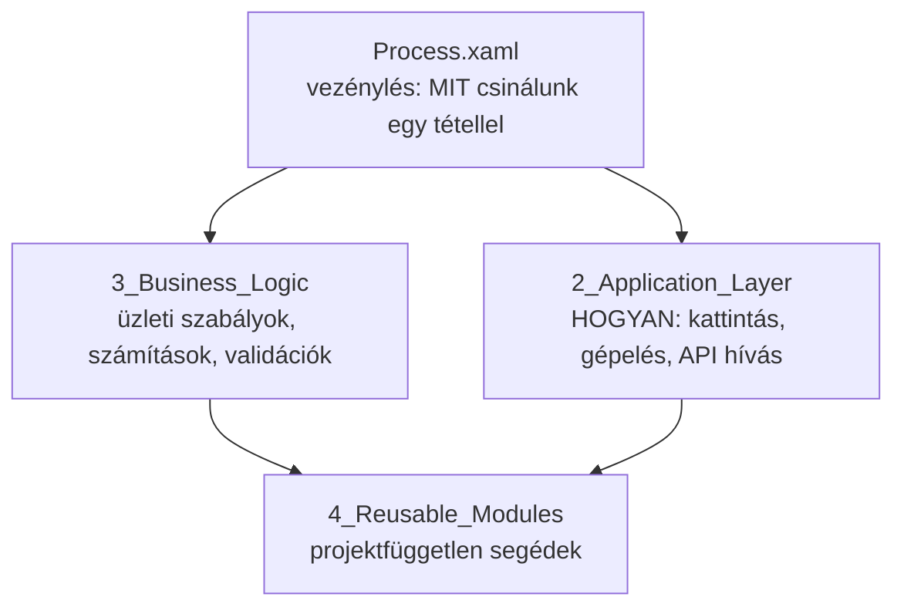

# 5. Fejlesztési szabályok és best practice-ek

[← Tartalom](README.md)

## 5.1 Rétegek – mi hova kerül?



| Réteg | Mit tartalmaz? | Mit NE tartalmazzon? |
|---|---|---|
| `Process.xaml` | A lépések sorrendje, döntések a tétel szintjén | UI kattintások, selectorok, bonyolult számítás |
| `2_Application_Layer/<Alkalmazás>/` | Egy alkalmazás egy művelete: `SAP_Login`, `SAP_KeresSzamla` | Üzleti döntések („ha az összeg > 1M, akkor …”) |
| `3_Business_Logic/` | Szabályok, validáció, adatátalakítás (lehetőleg **coded workflow**) | UI műveletek |
| `4_Reusable_Modules/` | Bármely projektben használható segédek | Projekt-specifikus logika |

**Ökölszabály:** ha egy workflow-t nem tudsz egy mondatban leírni, túl sokat csinál. Bontsd szét.

## 5.2 Elnevezési konvenciók

| Elem | Konvenció | Példa |
|---|---|---|
| Workflow fájl | `Alkalmazás_IgeTárgy` PascalCase | `SAP_KeresSzamla.xaml`, `Excel_OlvasBemenet.xaml` |
| Coded workflow osztály | PascalCase, fájlnév = osztálynév | `SzamlaValidacio.cs` |
| Argumentum | `in_`, `out_`, `io_` prefix + PascalCase | `in_SzamlaSzam`, `out_Talalat`, `io_Szamlalo` |
| Változó | camelCase, beszédes név | `szamlaOsszeg`, `vevoTabla` |
| Jelszó / token változó | tartalmazza a `password`/`token` szót | `sapPassword`, `apiToken` (a maszkolás miatt!) |
| DataTable | `dt` prefix vagy `Tabla` utótag | `dtSzamlak`, `szamlaTabla` |
| Activity DisplayName | Mit csinál, nem azt, hogy mi az | ✅ `Click 'Mentés' gomb` ❌ `Click` |
| Hibakód | `PRJ-<BE\|SYS>-<TERÜLET>-<NNN>` | `PRJ-BE-INV-001` |

## 5.3 Workflow dokumentáció (annotáció)

Minden workflow fő Sequence-ének annotációjába írd be (ez az MPRT workflow sablon formája):

```text
Modul feladata: Megkeresi a számlát a SAP-ban szám alapján.

Belső változók: talalatDb<int>

Argumentumok:
 in:  in_SzamlaSzam<string>  – a keresett számla száma
 out: out_Talalat<bool>      – igaz, ha a számla megvan
 io:  –

Kivételek: PRJ-SYS-SAP-001 (SAP nem válaszol)
```

- Bonyolult döntés (If / Switch) mellé írj annotációt arról, **miért** úgy döntünk.
- Ne kommentezz ki kódot „hátha kell még”: a git megőrzi. A `CommentOut` blokkokat élesítés előtt töröld.

## 5.4 Argumentumok

- Egy workflow **csak argumentumon keresztül** kommunikáljon. `GlobalVariables.Config` olvasása rendben van, de ne írj a globális változókba a keretrendszeren kívül.
- **Kötelező argumentumot** jelölj `RequiredArgument`-tel, és a workflow elején ellenőrizd:

```csharp
// Coded workflow-ban:
ArgumentNullException.ThrowIfNullOrWhiteSpace(szamlaSzam);
```

- Ne adj át egész `QueueItem`-et oda, ahol csak egy mező kell. `in_SzamlaSzam` jobb, mint `in_TransactionItem`, mert így a workflow tesztelhető queue nélkül is.

## 5.5 Logolás

| Szint | Mikor? | Példa |
|---|---|---|
| `Trace` | Részletes hibakeresési infó | `Mező értéke: …` |
| `Info` | Folyamat mérföldkövei | `Számla rögzítve: 12345` |
| `Warn` | Nem hiba, de figyelni kell | `A vevő címe hiányzik, alapértelmezett használva` |
| `Error` | Hiba (a keretrendszer logolja) | – |
| `Fatal` | A robot nem tud tovább futni | `Config betöltés sikertelen` |

Szabályok:
- ✅ Minden workflow elején és végén egy `Info` log, a legfontosabb bemenettel és eredménnyel.
- ✅ A log tartalmazza a **tétel azonosítóját** (Reference), hogy vissza lehessen keresni.
- ❌ **Soha ne logolj jelszót, tokent, személyes adatot** (név, adóazonosító, bankszámlaszám). A logok Orchestratorba kerülnek, és sokan látják.
- ❌ Ne logolj ciklusban minden sort `Info` szinten, mert ez elárasztja a logot. Használj `Trace` szintet, vagy egy összesítő logot a ciklus végén.
- ❌ `BusinessRuleException` előtt ne logolj külön: a kivétel üzenete a keretrendszer logjában amúgy is megjelenik.

## 5.6 UI automatizálás

- ✅ Használj **modern activityket**: Use Application/Browser, Click, Type Into.
- ✅ **Stabil selectorok:** `id`, `name`, `automationid` attribútumok. Kerüld az `idx`-et és a pozíciót.
- ✅ Változó szöveget **wildcarddal** (`*`) vagy **változóval** kezelj a selectorban, ne fix értékkel.
- ✅ Várj **feltételre**, ne időre: Check App State / Element Exists. A `Delay` az utolsó eszköz.
- ✅ Adj meg értelmes **Timeoutot**. Az alapértelmezett 30 mp sokszor túl sok vagy túl kevés.
- ✅ Ha egy UI elem hiánya **üzleti** helyzetet jelez (pl. „Nincs találat” felirat), azt vizsgáld meg, és dobj `Err.Business`-t. Ne hagyd, hogy SelectorNotFound rendszerhibaként végződjön.
- ❌ Ne használj `SendHotkey`-t és koordináta alapú kattintást, ha van jobb megoldás.

## 5.7 Adatkezelés és C# kifejezések

- ✅ Rövid, olvasható LINQ szűrésre és átalakításra:

```csharp
// Szűrés + projekció egy lépésben
var nyitottSzamlak = dtSzamlak.AsEnumerable().Where(r => r.Field<string>("Statusz") == "Nyitott").Select(r => r.Field<string>("Szam")).ToList();

// Csoportosítás → Dictionary
var osszegVevonkent = dtSzamlak.AsEnumerable().GroupBy(r => r.Field<string>("Vevo")).ToDictionary(g => g.Key, g => g.Sum(r => r.Field<decimal>("Osszeg")));
```

- ✅ Null-biztos hozzáférés: `?.`, `??`, `GetValueOrDefault`, `TryParse`.
- ✅ Oszlopneveket konstansban tárolj (coded workflow-ban `private const string`).
- ❌ Ne írj 5 soros LINQ-t egy Assign-ba. Ha nem fér el egy sorban olvashatóan, tedd coded workflow-ba.
- ❌ Ne hasonlíts típust stringgel (`GetType().ToString() == "..."`). Használd az `is` operátort.
- ❌ Dátumot és számot ne parsolj kultúra nélkül: `DateTime.ParseExact(s, "yyyy.MM.dd", CultureInfo.InvariantCulture)`.

## 5.8 Coded workflow-k (C#)

Üzleti logikához és adatfeldolgozáshoz a coded workflow sokszor olvashatóbb és tesztelhetőbb, mint a XAML.

```csharp
using System;
using System.Data;
using System.Linq;
using UiPath.CodedWorkflows;
using GEHMPRTQUEUECSharp.ErrorHandling;

namespace GEHMPRTQUEUECSharp._3_Business_Logic
{
    /// <summary>Ellenőrzi a számla üzleti szabályait.</summary>
    public class SzamlaValidacio : CodedWorkflow
    {
        private const string OsszegColumn = "Osszeg";

        /// <param name="szamlaSzam">A számla száma.</param>
        /// <param name="szamla">A számla adatai (egy sor).</param>
        /// <exception cref="UiPath.Core.BusinessRuleException">PRJ-BE-INV-002, ha az összeg negatív.</exception>
        [Workflow]
        public void Execute(string szamlaSzam, DataRow szamla)
        {
            ArgumentNullException.ThrowIfNullOrWhiteSpace(szamlaSzam);
            ArgumentNullException.ThrowIfNull(szamla);

            var osszeg = szamla.Field<decimal>(OsszegColumn);
            if (osszeg < 0)
                throw Err.Business("PRJ-BE-INV-002", szamlaSzam, osszeg);

            Log($"[{nameof(SzamlaValidacio)}] {szamlaSzam} – validáció rendben");
        }
    }
}
```

Szabályok:
- Az osztály `CodedWorkflow`-ból örököl, a belépési pont `[Workflow] Execute(...)`.
- Belépési validáció: `ArgumentNullException.ThrowIfNull` / `ThrowIfNullOrWhiteSpace`.
- Üzleti hiba: `Err.Business(...)`. Ne kapd el, ne logold előtte külön.
- Nincs `try-catch` az `Execute`-ban (kivéve a 4.6 szerinti átfordítást), és nincs `Console.WriteLine`.
- XML dokumentáció minden public metódusra (`<summary>`, `<param>`, `<returns>`, `<exception>`).

## 5.9 Biztonság

- ✅ Jelszó csak **credential assetben** legyen, és `SecureString`-ként kezeld. `Type Secure Text` / `Get Credential`.
- ✅ A jelszót tartalmazó változó nevében legyen `password`, `pwd`, `token` vagy `secret` (maszkolás).
- ❌ Soha ne alakítsd a `SecureString`-et sima stringgé, ha nem feltétlenül szükséges. Ha mégis kell, csak lokális, rövid életű változóban tárold.
- ❌ Soha ne kerüljön jelszó, token vagy kapcsolati string a `Config.xlsx`-be, a kódba vagy a repóba.
- ❌ Ne küldj e-mailben személyes adatot. Az e-mail csak a tétel azonosítóját tartalmazza.

## 5.10 Verziókezelés (git)

- Egy commit = egy logikai változás. A commit üzenet mondja meg, **mit és miért**.
- Commit előtt **Studióban nyisd meg és mentsd** a módosított XAML-eket, és futtasd a **Workflow Analyzert**.
- XAML konfliktust ne oldj fel kézzel szerkesztve, ha nem muszáj. Egyeztess a kollégával, és egyikőtök változtatását vidd át Studióban.
- Ne commitold a `.local`, `.objects`, `.screenshots` mappákat és a futás közben keletkező fájlokat.
- Minden változtatás **pull requesten és reviewn** keresztül kerüljön a fő ágba ([8. fejezet](08_Ellenorzo_listak.md)).

## Összefoglaló

- Process = mit, Application Layer = hogyan, Business Logic = szabályok.
- Beszédes nevek, `in_`/`out_`/`io_` argumentumok, annotáció minden workflow-n.
- Logolj mérföldköveket, soha ne logolj érzékeny adatot.
- Stabil selectorok, feltételre várás, üzleti helyzetre `Err.Business`.
- Jelszó csak credential assetben.
